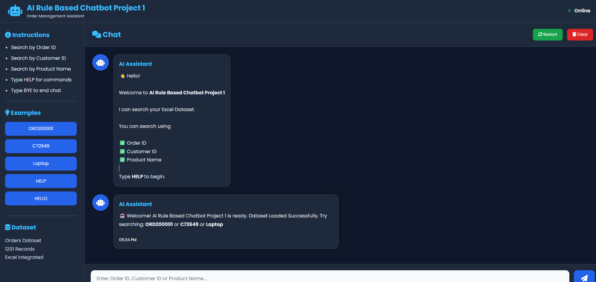
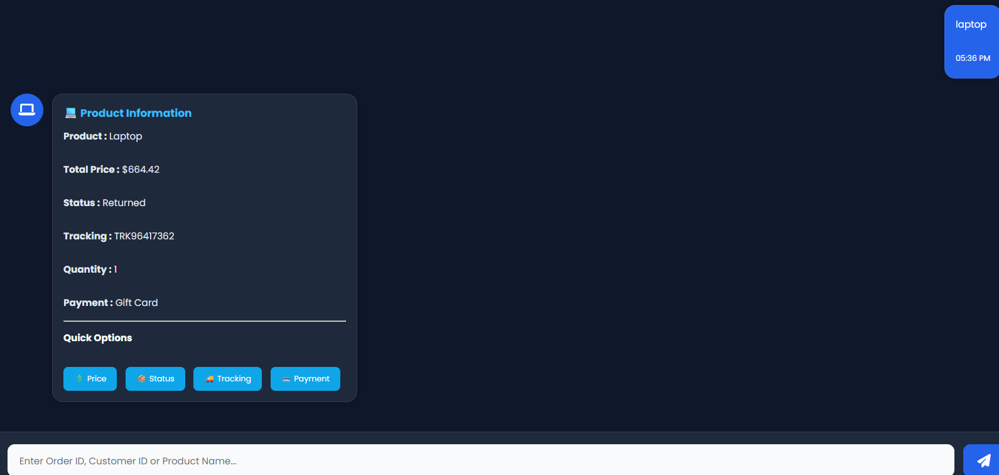
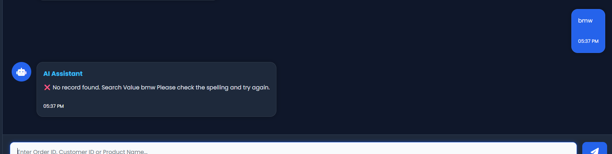
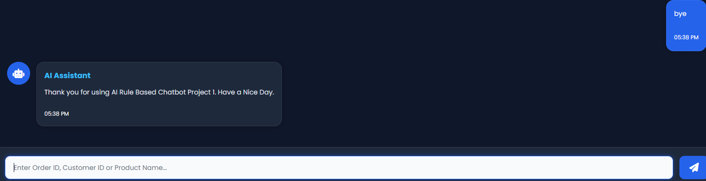

AI Rule-Based Order Chatbot

A web-based "Rule-Based Order Chatbot" developed using ""Python, Flask, Pandas, HTML, CSS, and JavaScript". 
The chatbot allows users to search order information from an Excel dataset using Order ID, Customer ID, or Product Name through a simple and interactive chat interface.

📌 Features

- 🔍 Search by Order ID
- 👤 Search by Customer ID
- 📦 Search by Product Name
- 💬 Interactive Chat Interface
- 📊 Excel Dataset Integration
- ⚡ Fast Rule-Based Search
- 🎨 Responsive User Interface
- 🔄 Restart & Clear Chat
- ❌ Invalid Search Handling
- 👋 Greeting and Goodbye Responses


🛠 Technologies Used

- Python
- Flask
- Pandas
- HTML5
- CSS3
- JavaScript
- Excel


📂 Project Structure

```text
AI-Rule-Based-Order-Chatbot/
│
├── app.py
├── requirements.txt
├── data/
├── static/
├── templates/
└── screenshots/
```

 Installation

1. Clone the repository

```bash
git clone https://github.com/ridaislam0709-glitch/AI-Rule-Based-Order-Chatbot.git
```

2. Open the project folder

```bash
cd AI-Rule-Based-Order-Chatbot
```

3. Install required packages

```bash
pip install -r requirements.txt
```

4. Run the application

```bash
python app.py
```

---

Project Screenshots


> Home Page

The home page provides a clean and interactive chat interface where users can enter their queries and search order information.




> Product Search

The chatbot successfully retrieves product details including price, quantity, payment method, tracking information, and order status.




> Invalid Search

When a user enters an invalid keyword or unavailable record, the chatbot displays an appropriate "No Record Found" message.



> Goodbye Response

When the user types "bye", the chatbot ends the conversation with a friendly goodbye message.




Future Improvements

- Database Integration (MySQL)
- Natural Language Processing (NLP)
- Voice-Based Chatbot
- User Authentication
- Admin Dashboard
- Order Update & Tracking Features


Author
"Rida Islam Shabbir"
BS Artificial Intelligence Student


⭐ If you found this project useful, consider giving it a Star on GitHub.
